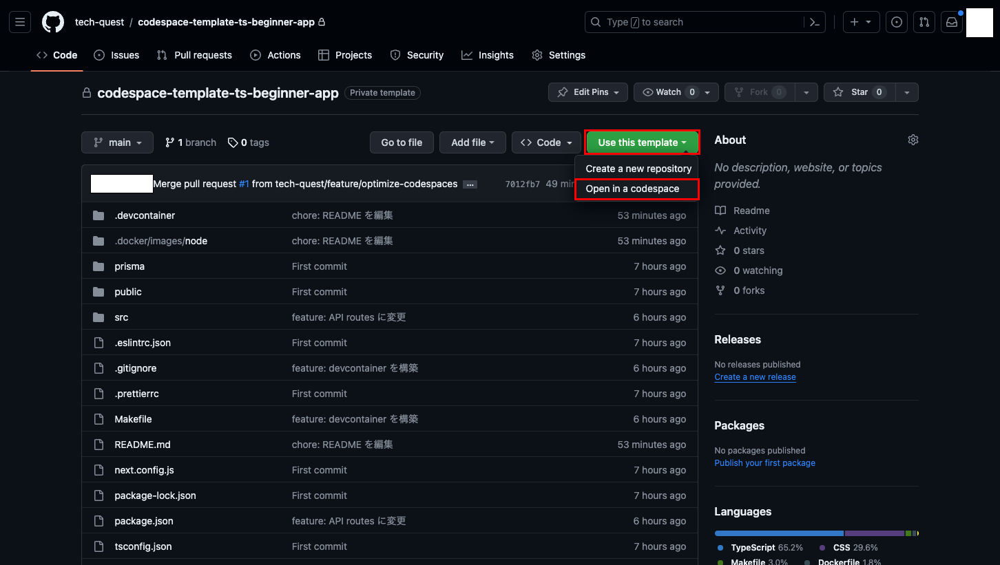
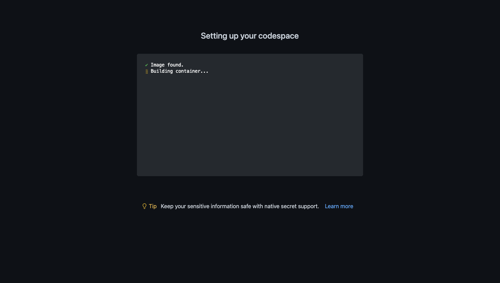
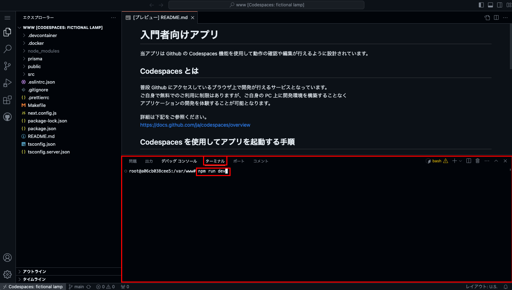
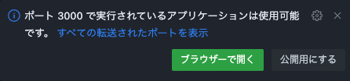
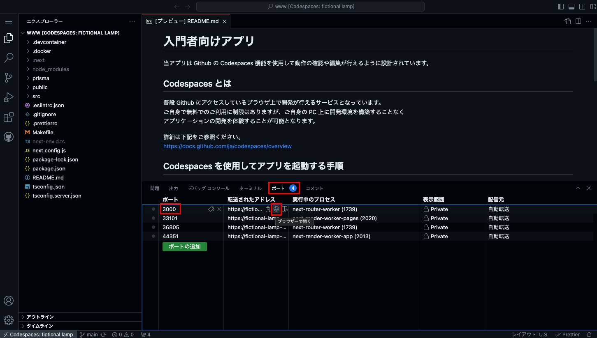
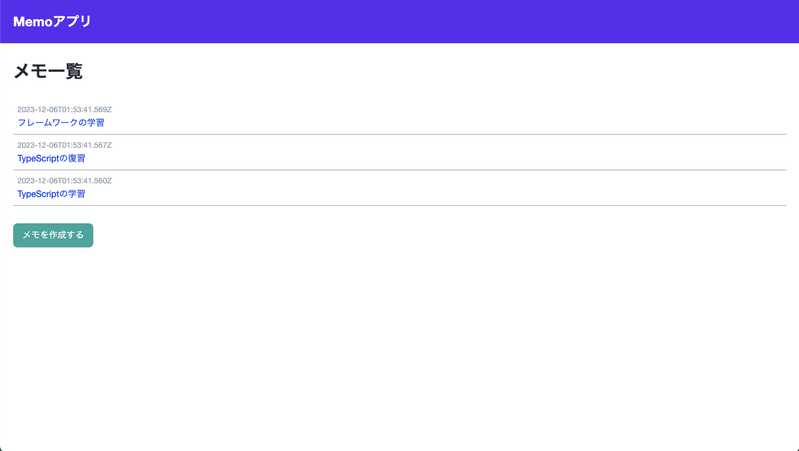

# 学習用教材: 簡易ブログアプリ

今回は簡易ブログアプリの作成を進めていきましょう。
今回のアプリは以下のような構成になっています。

- ブログが表示されるユーザー画面<br>
  ブログの記事を読みに来る仮想ユーザー向けに表示される画面になります。<br>
  普段インターネット上で見るのはこちらの画面になります。
- ブログ管理画面<br>
  URL に `/admin` がついているページはブログの管理画面となります。<br>
  こちらはブログの管理者が記事を投稿したり、自分が投稿した記事の一覧を確認できる画面になります。<br>
  ブログの管理者が使用する画面になるので「下書き」状態の未公開記事なども内容を確認できるようになっています。

今回の簡易ブログではログイン機能などは備わっていないので<br>
URL さえ知っていれば誰でも記事を改変できたりしてしまうので実務では使用できません。<br>
ですが、ユーザー画面と管理画面という構成は Web アプリケーションでは基本の構成と読んでも過言ではない構成となります。<br>
このアプリケーションを通じて基本を抑えていきましょう！

## 動かし方

当アプリは Github の Codespaces 機能を使用して動作の確認や編集が行えるように設計されています。

### Codespaces とは

普段 Github にアクセスしているブラウザ上で開発が行えるサービスとなっています。  
ご自身で無料でのご利用に制限はありますが、ご自身の PC 上に開発環境を構築することなく  
アプリケーションの開発を体験することが可能となります。

詳細は下記をご参照ください。  
https://docs.github.com/ja/codespaces/overview

### Codespaces を使用してアプリを起動する手順

#### 1. 新規スペースを作成する

まずはじめに新規スペースを作成してエディタを立ち上げます。

以下画面を参考にし、当リポジトリの「Use this template」ボタンをクリックして「Open in a codespace」をクリックしてください。


※ 画像に表示されている画面は当リポジトリではありません

以下画面に切り替わり、開発環境が自動で構築されます。



※ 構築が完了するまで数分かかる場合があります。

#### 2. ターミナルでアプリの起動コマンドを実行する

1 でスペースの作成が完了すると、コードを編集するためのエディタが表示されます。

エディタ下部にあるターミナル画面に以下コマンドを入力してエンターキーで実行し、アプリケーションを起動してください。

```
npm run dev
```



#### 3. 起動したアプリをブラウザで確認する

2 でアプリの起動が完了すると、右下に以下のようなポップアップが表示されますので「ブラウザーで開く」をクリックしましょう。



上記が表示されない場合は以下の画像を参考にエディター下部の「ポート」タブから「3000」番のポートを探し、地球儀アイコンをクリックすることでも開くこともできます。



ブラウザで開いたら下記画面が表示されれば起動成功になります！


※ 画像に表示されている画面はアプリによって異なります
